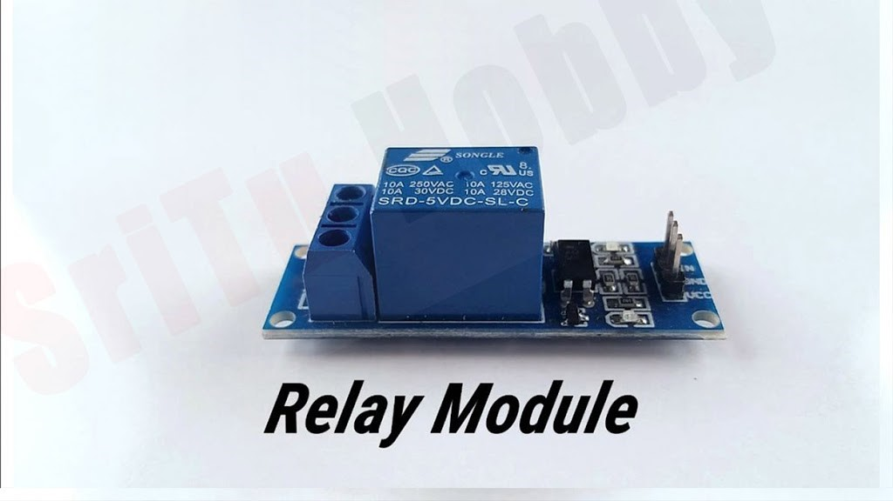

# 👏 Simple Clap Switch Circuit using CD4017

<p align="center">
  
</p>

A simple clap-operated switch built using the **CD4017 Decade Counter IC**. The circuit detects a clap using a condenser microphone and toggles an electrical load (such as a lamp) ON and OFF through a relay.

This project was developed as part of the **ECE 6th Semester Minor Project (2023)** at the **Indian Institute of Information Technology (IIIT), Bhopal**.

---

# 📖 Project Overview

The project demonstrates how sound signals can be converted into electrical pulses to control electrical appliances.

Whenever a clap is detected:

- 🎤 Microphone senses the sound
- ⚡ Signal is amplified
- 🔄 CD4017 receives the pulse
- 💡 Relay toggles the load ON/OFF

---

# ✨ Features

- Clap operated switching
- CD4017 Decade Counter
- Relay-based appliance control
- Low-cost circuit
- Beginner-friendly electronics project
- No programming required

---

# 🛠 Components Used

- CD4017 IC
- Condenser Microphone
- BC547 Transistors
- Relay Module
- Diodes
- Capacitors
- Resistors
- LED
- Power Supply
---
## Hardware Components

<p align="center">
  
  
</p>
---

# ⚙ Working Principle

1. The microphone detects a clap.
2. The signal is amplified.
3. The amplified pulse is sent to the CD4017.
4. The CD4017 changes its output state.
5. The transistor drives the relay.
6. The connected appliance turns ON or OFF.

---

# 🔌 Circuit Diagram

The complete circuit diagram used in this project is shown below.

<p align="center">

</p>

---

# 📂 Project Structure

```text
Simple-Clap-Switch-CD4017
│
├── Circuit_Diagram/
│   ├── Circuit_Diagram.png
│   └── README.md
│
├── Images/
│
├── Report/
│   └── Minor_Project_Report.pdf
│
├── LICENSE
├── README.md
└── .gitignore
```

---

# 📄 Report

The complete project report is available in the **Report** folder.

📄 **Project Report:** [Minor_Project_Report.pdf](Report/Minor_Project_Report.pdf)

# 📱 Applications

- Clap-controlled lighting
- Home automation basics
- Electronics laboratory experiments
- Embedded systems learning
- Engineering mini projects

---

# 🎯 Learning Outcomes

- Digital electronics
- CD4017 IC operation
- Relay interfacing
- Audio signal detection
- Transistor switching
- Basic circuit design

---

# 👨‍🏫 Supervisor

**Dr. Bhupendra Singh Kirar**

Assistant Professor

Department of Electronics & Communication Engineering

Indian Institute of Information Technology (IIIT), Bhopal

---

# 👥 Team Members

Group 10

- Arpeet Bhaisare
- Abhishek Brajvasi
- Srirama Aniketh
- Samarth Varshney

---

⭐ If you found this project useful, consider giving this repository a Star.

---

# 📄 License

This repository is licensed under the MIT License.
